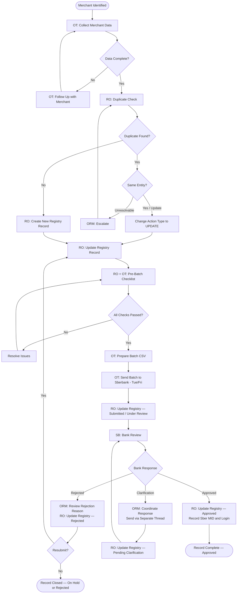

# Merchant Onboarding Process Flow — Sberbank Internet Acquiring

**Document type:** Internal Process Reference  
**Version:** 1.0  

---

## 1. Process Overview

This document describes the end-to-end merchant onboarding lifecycle from merchant identification through to confirmed Sberbank registration. It defines who performs each step and in what sequence.

---

## 2. Roles

| Role | Abbreviation | Responsibility |
|------|-------------|----------------|
| Onboarding Team | OT | Collects merchant data; prepares batch submissions; sends emails |
| Registry Owner | RO | Maintains central registry; performs duplicate checks; manages status updates |
| Operations / Relationship Manager | ORM | Manages bank relationship; handles escalations, rejections, and clarifications |
| Sberbank | SB | Reviews submissions; approves or rejects registrations; requests clarifications |

---

## 3. Step-by-Step Process

### Step 1 — Merchant Identified
**Owner: Onboarding Team**

A new merchant is identified for onboarding to Sberbank internet acquiring. The Onboarding Team begins collecting the required merchant data (legal name, website URL, app URL if applicable, payment methods, channel type).

---

### Step 2 — Data Collected and Validated
**Owner: Onboarding Team**

All mandatory data fields are collected from the merchant or internal source. The Onboarding Team reviews the data for completeness against the mandatory fields list in the onboarding checklist.

If data is incomplete, the Onboarding Team follows up with the merchant before proceeding.

---

### Step 3 — Duplicate Check
**Owner: Registry Owner**

Before any record is entered into the registry, the Registry Owner performs a duplicate check:
- Search by merchant name
- Search by website URL
- Search by app URL

**If no duplicate found:** Proceed to Step 4.  
**If duplicate found:** Determine whether this is a new entity or an update to an existing record. If an update, classify as `Action_Type = UPDATE` and proceed. If an irresolvable conflict, escalate to the Operations Manager.

---

### Step 4 — Registry Entry / Update
**Owner: Registry Owner**

The merchant record is entered into (or updated in) the central merchant registry with:
- All mandatory data fields populated
- `Action_Type` set to `NEW` or `UPDATE`
- `Internal_Status` set to `Draft` initially, then `Pending Submission` once validated
- `Duplicate_Check = YES`
- `Owner` assigned
- `Ready_for_Batch` left as `NO` until sign-off

---

### Step 5 — Pre-Batch Sign-Off
**Owner: Registry Owner + Onboarding Team**

On the day before (or morning of) the Tuesday/Friday batch:
- The pre-batch checklist is completed for all records flagged `Ready_for_Batch = YES`
- All checklist sections are confirmed
- `Ready_for_Batch` is confirmed as `YES` for all clean records
- The batch CSV is prepared from the registry

---

### Step 6 — Batch Sent to Sberbank
**Owner: Onboarding Team**

The batch CSV is attached to the standard batch submission email and sent to the designated Sberbank contact on Tuesday or Friday.

Post-send registry updates:
- `Internal_Status → Submitted`
- `Bank_Status → Under Review`
- `First_Sent_Date` populated (for NEW records)
- `Last_Update_Date` updated

---

### Step 7 — Bank Review
**Owner: Sberbank**

Sberbank reviews the batch submission. This may result in:
- **Approval** of one or more merchants
- **Rejection** of one or more merchants
- **Clarification request** for additional information

Response is received by the Operations / Relationship Manager.

---

### Step 8a — Approval
**Owner: Registry Owner (updates) / Operations Manager (communication)**

Upon receipt of Sberbank approval:
- `Bank_Status → Approved`
- `Internal_Status → Approved`
- `Sber_Merchant_ID` and `Login` recorded in registry (if assigned by bank at this stage)
- `Last_Update_Date` updated
- `Bank_Comment` updated if any notes received

---

### Step 8b — Rejection
**Owner: Operations Manager (lead) / Registry Owner (updates)**

Upon receipt of a rejection:
- `Bank_Status → Rejected`
- `Internal_Status → Rejected`
- Rejection reason recorded in `Bank_Comment`
- `Last_Update_Date` updated
- Operations Manager reviews rejection reason and determines corrective action
- If resubmission is required, record is corrected and `Internal_Status` reset to `Pending Submission` for the next batch

---

### Step 8c — Clarification Requested
**Owner: Operations Manager (lead) / Registry Owner (updates)**

Upon receipt of a clarification request from Sberbank:
- `Bank_Status → Clarification Requested`
- `Internal_Status → Pending Clarification`
- Clarification details recorded in `Bank_Comment`
- Operations Manager coordinates with Onboarding Team or merchant to gather required information
- Response sent to Sberbank using the clarification email template, in a **separate thread** from the batch submission
- Upon resolution, registry is updated and record re-queued for batch if required

---

### Step 9 — Registry Closed or Maintained
**Owner: Registry Owner**

Once a merchant reaches `Bank_Status = Approved`, the record is considered complete. The registry entry is retained permanently as the audit record.

All subsequent changes (e.g., new channel, URL change) are processed as UPDATE records through the standard flow.

---

## 4. Process Flowchart

---

## 5. Summary of Ownership by Stage

| Stage | OT | RO | ORM | SB |
|-------|----|----|-----|----|
| Data collection | ✓ | | | |
| Duplicate check | | ✓ | | |
| Registry entry | | ✓ | | |
| Pre-batch checklist | ✓ | ✓ | | |
| Batch preparation | ✓ | | | |
| Batch submission | ✓ | | | |
| Post-send registry update | | ✓ | | |
| Bank review | | | | ✓ |
| Approval processing | | ✓ | ✓ | |
| Rejection handling | | ✓ | ✓ | |
| Clarification coordination | | ✓ | ✓ | |
